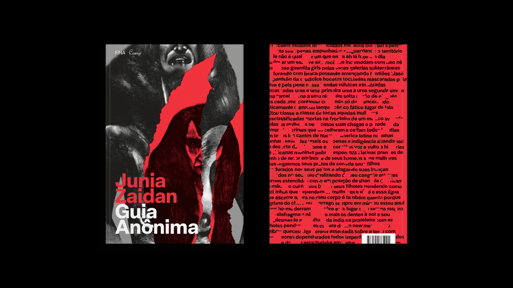
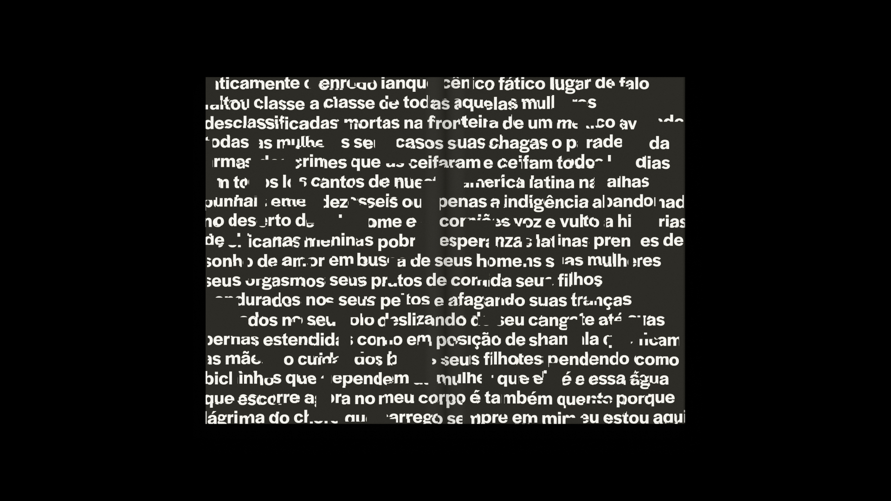

# Ragged Text  

A quick way to get some ragged text with [DrawBot](https://www.drawbot.com).

## About

This code was originally made for the visual identity of the book *Guia Anônima*, by **Junia Zaidan**. The idea behind this was to reference punk posters and anonymous letters, but in a more contemporary way: instead of individually cut letters, the expected end result was something akin to the style known as "swiss grit", popularized by [Chris Ashworth](https://www.instagram.com/ashworthchris/).  

[Check out the full project of the book on Behance](https://be.net/werls)  

## Examples

### Basic output

### The way that the output images was used on the book

## Some thoughts on the algorithm

With the objective that at the end it would be possible to obtain a vectorized image, I used the DrawBot's [clipPath() function](https://www.drawbot.com/content/shapes/drawingPath.html?highlight=clippath#drawBot.clipPath), so at each loop the text is written/drawn in its entirety and a small part of it is selected. Perhaps this is not the smartest way to solve this problem, as it becomes a very time-consuming process depending on the amount of clipping needed, but it was certainly the fastest way to write this algorithm.  

Another way, faster and more direct, would be to use the DrawBot's [ImageObject() class](https://www.drawbot.com/content/image/imageObject.html?highlight=imageobject), so that the text only needs to be written once. But in the end, we will have a bitmap image (which would not work for my purpose in this work).  